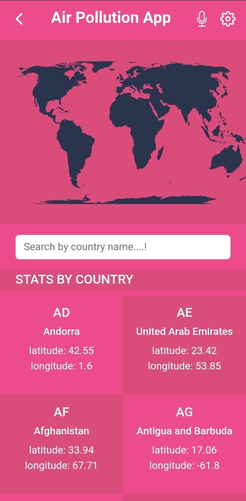
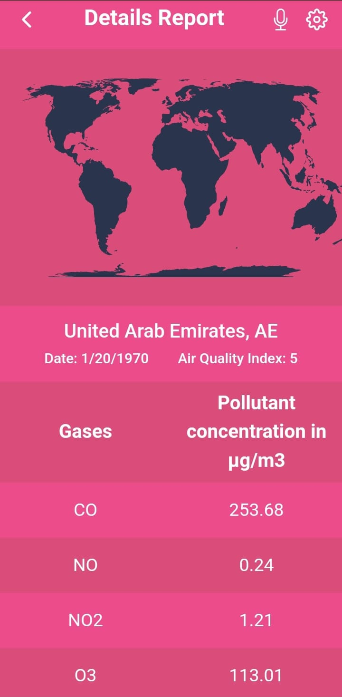

<a name="readme-top"></a>

<!--
HOW TO USE:
This is an example of how you may give instructions on setting up your project locally.

Modify this file to match your project and remove sections that don't apply.

REQUIRED SECTIONS:
- Table of Contents
- About the Project
  - Built With
  - Live Demo
- Getting Started
- Authors
- Future Features
- Contributing
- Show your support
- Acknowledgements
- License

After you're finished please remove all the comments and instructions!
-->

<div align="center">

     

</div>

<!-- TABLE OF CONTENTS -->

# 📗 Table of Contents

- [📖 About the Project](#about-project)
  - [🛠 Built With](#built-with)
    - [Tech Stack](#tech-stack)
    - [Key Features](#key-features)
  - [🚀 Live Demo](#live-demo)
- [💻 Getting Started](#getting-started)
  - [Setup](#setup)
  - [Prerequisites](#prerequisites)
  - [Install](#install)
  - [Usage](#usage)
  - [Run tests](#run-tests)
  - [Deployment](#triangular_flag_on_post-deployment)
- [👥 Authors](#authors)
- [🔭 Future Features](#future-features)
- [🤝 Contributing](#contributing)
- [⭐️ Show your support](#support)
- [🙏 Acknowledgements](#acknowledgements)
- [❓ FAQ](#faq)
- [📝 License](#license)

<!-- PROJECT DESCRIPTION -->

# 📖 Air Pollution App <a name="about-project"></a>

This mobile-web application retrieves data on air pollution from an API and displays it in a web browser. It was designed using React and Redux.

## 🛠 App Screen-Shots <a name="app-screen-shots"></a>

<div align="center">
     
     
</div>


## 🛠 Built With <a name="built-with"></a>

<a name="built-with"> <br>  <br>  <br>  <br> </a>

### Tech Stack <a name="tech-stack"></a>

<details>
  <summary>Client</summary>
  <ul>
    <li><a href="https://reactjs.org/">React.js</a></li>
  </ul>
</details>

<details>
<summary>Database</summary>
  <ul>
    <li><a href="https://openweathermap.org/api/air-pollution#:~:text=Air%20Pollution%20API%20concept,-Air%20Pollution%20API&text=Besides%20basic%20Air%20Quality%20Index,PM2.5%20and%20PM10).">Air Pollution API</a></li>
  </ul>
</details>

<!-- Features -->

### Key Features <a name="key-features"></a>

- SPA

<p align="right">(<a href="#readme-top">back to top</a>)</p>

<!-- LIVE DEMO -->

## 🚀 Live Demo <a name="live-demo"></a>

> Add a link to your deployed project.

- [Live Demo Link](https://air-pollution.onrender.com/)

<p align="right">(<a href="#readme-top">back to top</a>)</p>

<!-- GETTING STARTED -->

## 💻 Getting Started <a name="getting-started"></a>

To get a local copy up and running, follow these steps.

### Prerequisites

In order to run this project you need:
- [Node](https://nodejs.org/en/) installed in your computer
- [Git](https://git-scm.com/) installed in your computer

<!--
Example command:

```sh
 gem install rails
```
 -->

### Setup

Clone this repository to your desired folder:

```sh
  cd my-folder
  git clone https://github.com/Mujeeb4582/Space-X.git
```

### Install

Install this project with:

```sh
  cd my-project
  npm install
```
### Usage

To run the project, execute the following command:

```sh
  npm start
```

### Run tests

To run tests, run the following command:

```sh
  npm test
```

### Deployment

You can deploy this project using:

```sh
  npm build
```

<p align="right">(<a href="#readme-top">back to top</a>)</p>

<!-- AUTHORS -->

## 👥 Authors <a name="authors"></a>

> Mention all of the collaborators of this project.

👤 **Mujeeb ur Rahman**

- GitHub: [@Mujeeb4582](https://github.com/Mujeeb4582)
- Twitter: [@Mujeebu93992980](https://twitter.com/Mujeebu93992980)
- LinkedIn: [@Mujeeb](https://www.linkedin.com/in/rahman-mujeeb/)

<p align="right">(<a href="#readme-top">back to top</a>)</p>

<!-- FUTURE FEATURES -->

## 🔭 Future Features <a name="future-features"></a>

- Add search country by voice
- Allow user to add new data to API

<p align="right">(<a href="#readme-top">back to top</a>)</p>

<!-- CONTRIBUTING -->

## 🤝 Contributing <a name="contributing"></a>

Contributions, issues, and feature requests are welcome!

Feel free to check the [issues page](../../issues/).

<p align="right">(<a href="#readme-top">back to top</a>)</p>

<!-- SUPPORT -->

## ⭐️ Show your support <a name="support"></a>

> Write a message to encourage readers to support your project

If you like this project...

<p align="right">(<a href="#readme-top">back to top</a>)</p>

<!-- ACKNOWLEDGEMENTS -->

## 🙏 Acknowledgments <a name="acknowledgements"></a>

- Thanks to the Microverse team for the great curriculum.
- Thanks to the Code Reviewer(s) for the insightful feedback.
- Thanks to Nelson Sakwa on [Behance](https://www.behance.net/gallery/31579789/Ballhead-App-(Free-PSDs)) for providing us this template.
- Hat tip to anyone whose code was used.

<p align="right">(<a href="#readme-top">back to top</a>)</p>

<!-- FAQ (optional) -->

## ❓ FAQ <a name="faq"></a>

> Add at least 2 questions new developers would ask when they decide to use your project.

- **How to open the Air pollution details?**

  - *You can click/tap on the country name or card it will navigate to details report page.*

- **How to return to the home page?**

  - *You can click the left arrow located in the top-left corner of the page.*

<p align="right">(<a href="#readme-top">back to top</a>)</p>

<!-- LICENSE -->

## 📝 License <a name="license"></a>

This project is [MIT](https://github.com/Mujeeb4582/Air-Pollution-App/blob/react-redux-capstone/Licence) licensed.

<p align="right">(<a href="#readme-top">back to top</a>)</p>
